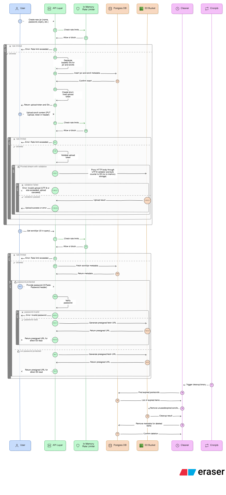

# Scrolljar Backend

Scrolljar is a pastebin-style backend service where users create **Jars** (collections) containing multiple **Scrolls** (📜 pastes).
This repository contains the API server, storage integration, and cleanup tooling.

## Core Concepts

* **Jar**: A collection of scrolls. Can be public or private and optionally password-protected.
* **Scroll**: A single paste belonging to a jar.
* **User**: Authenticated users can manage jars and scrolls.
* **Anonymous users**: Can create jars without signing in.

## Data Flow

    
View a Diagram

    

### Writing (Create & Upload)

1. Client sends jar/scroll metadata (name, password, expiry, etc.) to a create endpoint.
2. API:
   * Generates unique Base62 IDs for jars and scrolls
   * Stores metadata in PostgreSQL
   * Issues a short-lived **upload token**
3. Client uploads scroll content using `PUT /upload` with the upload token.
4. API streams the request body directly to S3:
   * No in-memory storage
   * Enforces size and encoding restrictions
   * Returns immediate errors on validation failure

### Reading (Fetch)

1. Client sends a `GET` request with the jar or scroll ID.
2. API fetches metadata from the database.
3. If password-protected, the password is provided via the `X-Paste-Password` header and verified.
4. API returns a **presigned S3 URL** for direct content access.

## Authentication

* Bearer token–based authentication
* Required for:
  * Deleting jars and scrolls
  * Updating scrolls
  - Accessing user and user-owned resources

## Rate Limiting

* Global rate limit applied to all requests
* IP-based limits:
  * **Strict**: user registration, activation
  * **Medium**: create, update, delete operations
  * **General**: read operations (jar / scroll)
